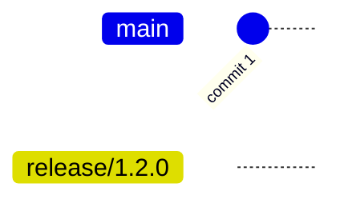
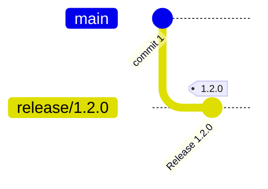
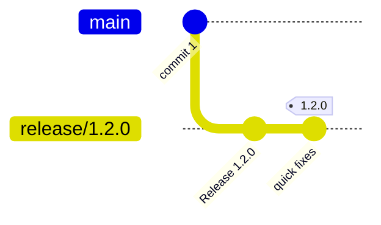
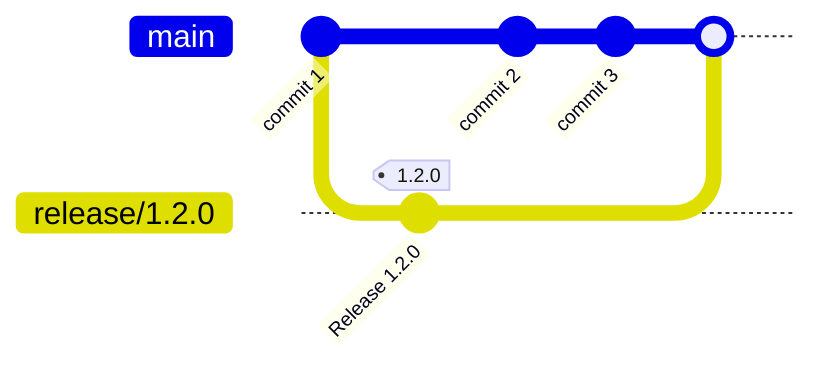
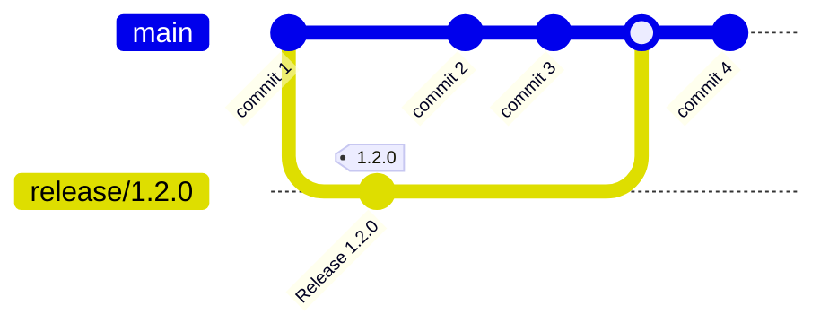
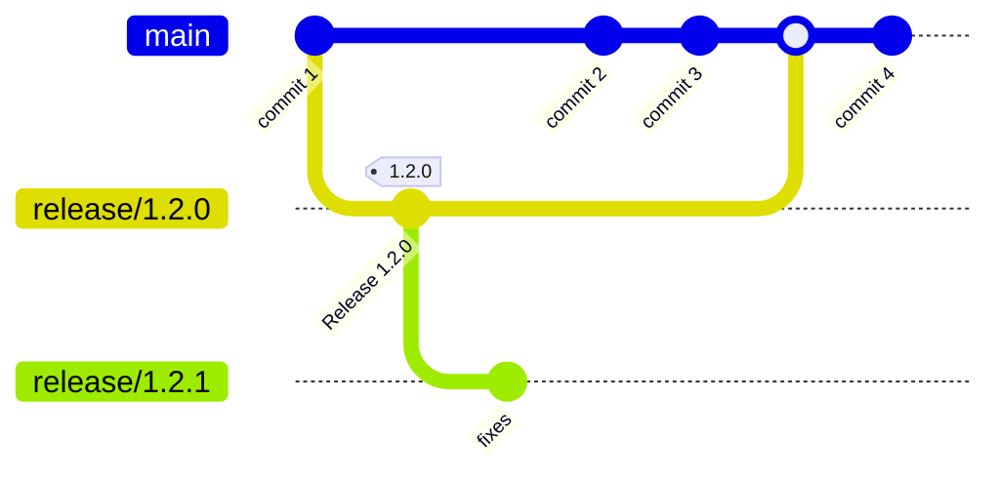
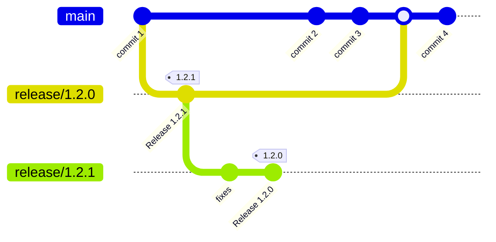
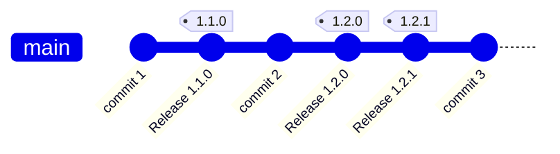
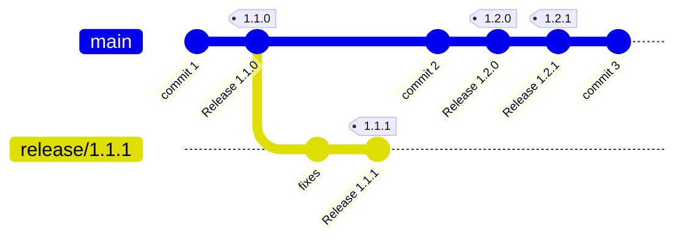

# GitHub Release Process

## Requirements

### GitHub Token

[Setup a GitHub token by going to your GitHub account](https://docs.github.com/en/enterprise-server@3.6/authentication/keeping-your-account-and-data-secure/managing-your-personal-access-tokens) (`Settings` -> `Developer Settings` -> `Personal access tokens` -> `Generate a new token`).

### Install GitHub Changelog Generator

Install the [GitHub Changelog Generator](https://github.com/github-changelog-generator/github-changelog-generator) by following the instructions.

## Release

Releasing a new version consists in:

- assign a semantic version number;
- bump version into relevant files as needed by the specific application (for example: package.json, mix.exs, etc);
- update the changelog;
- tag the repository with the version number;
- create a GitHub Release on the repository page;
- submit the version to the internal build service for distribution.

## Release example scenarios

This is a collection of examples of how to handle release in different scenarios while developing and avoiding merge freeze.
Examples focus on the branching model, but make use of version bump, changelog update and GitHub releases; please refer the proper section for detailed instructions.

### Release latest developments

Use case: the team decides to release latest developments.

Create a **_release branch_** from `main` in the shape `release/<next_version>`. In the given example, next version is `1.2.0`.



```sh
git checkout main
git checkout -b release/1.2.0
```

Checkout the release branch.
Edit changelog and bump version according to the instruction above.
Commit with message `Release <next_version>`: tag with the new version number.



```sh
git add .
git commit -m "Release 1.2.0"
git tag 1.2.0
```

Ideally, changes will not include any code changes other than the required by the version bump.
In case a fix is needed, remember to **move the tag to point to the latest commit of the release branch**.



```sh
git tag -d 1.2.0
git push --delete origin 1.2.0 # if the tag has been pushed already
git add .
git commit -m "Release 1.2.0"
git tag 1.2.0
```

Push the release branch along with the tag and open a pull request against the `main` branch.

```
git push --tags --set-upstream origin release/1.2.0
```

Let the maintainers review and approve the changes. If any changes is required, please ensure the tag refers to the last commit as explained in the previous step.

When the pull request is approved, the release branch can be merged.



Open a **draft** GitHub Release pointing to the release tag. Please note that any commit added to `main` after the release has been branched out will not be included in the released package.

Submit the release version to the internal build service for distribution, **referencing the tag**. When the distribution will be accepted, set the GitHub Release as **published**.

### Fix a rejected release

Use case: a submitted release has been rejected by the distribution process and a fix is needed.

The initial scenario will be something similar to the following diagram:



Please note that the release branch may or may not be deleted; this is not important as we reference the release tag.

Close the GitHub Release for the rejected version.

Create e new release branch from the previous release tag. In the example, we create `release/1.2.1` from the tag `1.2.0`.

Apply the needed changes and commit on the release branch.



```sh
git checkout 1.2.0
git checkout -b release/1.2.1
git add .
git commit -m "fixes"
```

Create a release commit with version bump and changelog. Tag the commit



```sh
git add .
git commit -m "Release 1.2.1"
git tag 1.2.1
```

Push the release branch and continue like it's a release from latest developments (see scenario above).

### Fix an older version

Use case: a bug is found on an older version

This scenario is very similar to fixing a rejected release except it requires attention when merging into main.

The initial scenario will be something similar to the following diagram:



Create a release branch starting from the tag of the version to fix. In the example, let's say a bug is found on `1.1.0` and it's needed to release `1.1.1` with relevant fixes.

Create a release commit, too, with version bump and updated changelog.



```sh
git checkout 1.1.0
git checkout -b release/1.1.1
git add .
git commit -m "fixes"
# version bump and changelog
git add .
git commit -m "Release 1.1.1"
git tag 1.1.1
```

Push the release branch along with the tag and open a pull request against the `main` branch.

```
git push --tags --set-upstream origin release/1.1.1
```

There might be conflicts: resolve them ensuring the changelog is in the correct order.

When ready, merge into `main`, open a GitHub Release, and submit to internal build service referencing the tag.

## Update Changelog

### Pull Latest Changes

Navigate to the project directory and pull the latest changes on the release branch relative to the version is going to be released.

### Tagging Pull Requests

Make sure appropriate labels are assigned to the pull requests included in the release to maintain a clean and organized changelog.
Supported labels are `bug` and `enhancement`. Any non-labelled pull request will be included in the generic _Merged Pull Requests_ section of the changelog.

### Generate Changelog

Use the [GitHub Changelog Generator CLI](https://github.com/github-changelog-generator/github-changelog-generator) to generate the changelog.

CLI:

```bash
github_changelog_generator --since-tag= <<CURRENT_TAG>> --future-release= <<RELEASE_VERSION_TAG>> -t <<GITHUB_TOKEN>> -p <<PROJECT_NAME>> -u <<PROJECT_GROUP>> --base CHANGELOG.md
```

| Variables:          | Explanation:                                                               | Examples:                                                                                                                                 |
| ------------------- | -------------------------------------------------------------------------- | ----------------------------------------------------------------------------------------------------------------------------------------- |
| CURRENT_TAG         | Changelog will start after specified tag.                                  | 2.1.0                                                                                                                                     |
| RELEASE_VERSION_TAG | Release version                                                            | 2.2.0                                                                                                                                     |
| PROJECT_NAME        | Name of project on GitHub                                                  | agent, helm-charts, wanda, web, ansible                                                                                                   |
| GITHUB_TOKEN        | Your personal Github Token                                                 | https://docs.github.com/en/enterprise-server@3.6/authentication/keeping-your-account-and-data-secure/managing-your-personal-access-tokens |
| PROJECT_GROUP       | Username of the GitHub repository OR namespace of target Github repository | trento-project                                                                                                                            |

CLI Example:

```bash
github_changelog_generator --since-tag=2.1.0 --future-release=2.2.0 -p agent -t <<GITHUB_TOKEN>> -u trento-project --base CHANGELOG.md
```

> If having issues with APIs rate limits, try adding `--max-issues 500` to the previous command

## Version Bump

### Version Upgrade

Search for the current version in every project file and perform a version bump.

Previous Release Examples:

- [Agent](https://github.com/trento-project/agent/pull/296)
- [Helm-Chart](https://github.com/trento-project/helm-charts/pull/82)
- [Wanda](https://github.com/trento-project/wanda/pull/341)
- [Web](https://github.com/trento-project/web/pull/1996)
- [Ansible Playbook](https://github.com/trento-project/ansible/pull/35)

## Release on GitHub

### Draft New Release

[Go to the repository's releases section and draft a new release](https://docs.github.com/en/repositories/releasing-projects-on-github/managing-releases-in-a-repository).

### Release Description

Use the generated changelog as the release description.

### Publish Release

This concludes the GitHub release process. For the next steps, proceed with our internal release process.
